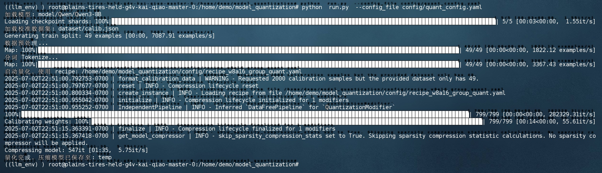
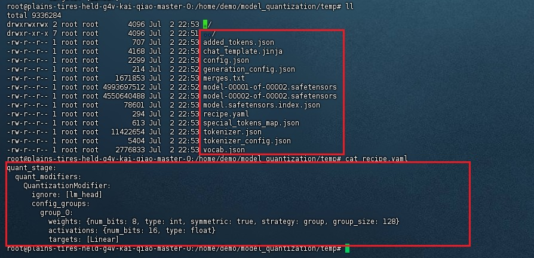
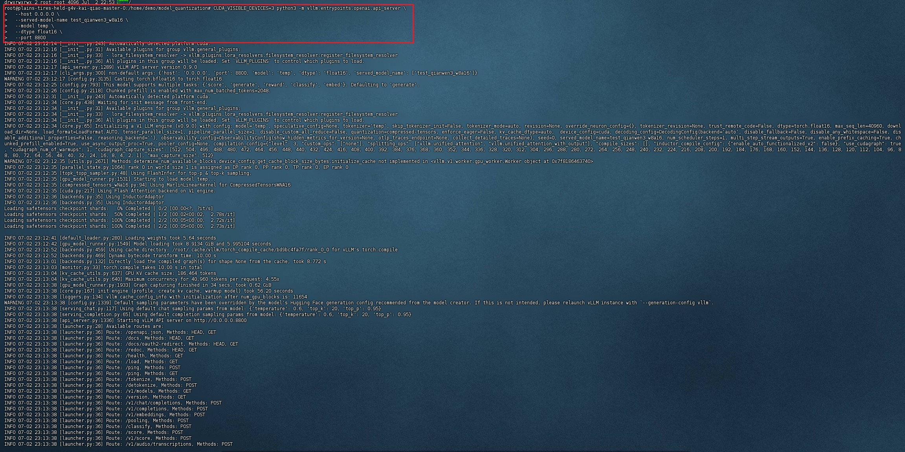
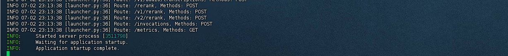
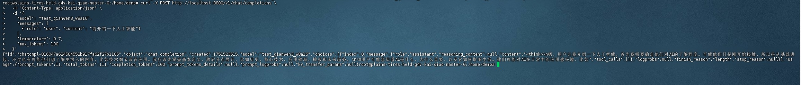

<div align="center">
# LLM Quantization Tool
</div>

> 使用到的项目开源地址：[llm-compressor](https://github.com/vllm-project/llm-compressor)
> 
> 使用说明：[LLM Compressor Docs](https://blog.vllm.ai/llm-compressor/main/getting-started/)

## catalogue
```markdown
model_quantization/
├── config                              # 配置文件相关
    ├── quant_config.yaml               # 量化的配置文件
    ├── recipe_w8a16_group_quant.yaml   # w8a16量化的一个配置
    ├── .....
├── README.md                           # 项目说明
├── dataset                             # 相关数据集
├── model                               # 存放模型文件
├── run.py                              # 量化的脚本
```

## usage

- 配置需量化的模型、校准数据、量化的recipe及输出路径等

```
model: TinyLlama/TinyLlama-1.1B-Chat-v1.0  # 模型名称或路径，支持 Hugging Face 模型仓库ID或者本地模型目录
dataset_id: HuggingFaceH4/ultrachat_200k     # 校准数据集ID，Hugging Face 上的 ultrachat_200k 数据集，用于量化时的激活校准
recipe: recipe_w4a16_group_quant_asym_awq.yaml  # 量化配置文件，指定具体量化策略（4-bit权重+16-bit激活，非对称AWQ分组量化）
max_sequence_length: 2048                    # 模型输入的最大序列长度，token数量上限，影响计算和内存使用
num_calibration_samples: 2000                # 用于量化校准的样本数量，越多精度越高但计算耗时增加
save_dir: temp                               # 量化完成后模型保存的目录路径，空值表示默认路径或者需手动填写
```

- 支持的数据格式，json文件

- 配置量化recipe

```
quant_stage:  # 表示这是量化阶段的配置，属于整个 LLM Compressor 的 recipe 的一部分
  quant_modifiers:  # 修饰符列表，用于配置具体的量化规则
    QuantizationModifier:  # 使用的量化类型是 QuantizationModifier（对模型参数/层进行量化）
      ignore: [lm_head]  # 在量化时忽略 lm_head 层（语言模型的输出层），保留其精度，避免影响最终输出质量

      config_groups:  # 对量化配置进行分组（可以支持多个配置组以对不同层用不同策略）
        group_0:  # 第一个配置组
          weights:  # 对权重参数的量化配置
            num_bits: 8  # 使用 8 位量化（INT8）
            type: int  # 表示数据类型为整数（int）
            symmetric: true  # 使用对称量化（权重分布中心对称，更易加速）
            strategy: group  # 使用组量化（group-wise），每 group_size 个参数为一组独立量化
            group_size: 128  # 每组包含 128 个参数通道，常见的高性能配置
            
          activations:  # 对激活值的量化配置
            num_bits: 16  # 使用 16 位精度（float16）
            type: float  # 类型为浮点数，不进行真正离散化，仅减精度保存计算精度

          targets: [Linear]  # 只对模型中所有 Linear 层进行量化（线性变换层）
```

- 开始量化命令

```
python  run.py  --config_file config/quant_config.yaml
```

## 已Qwen/Qwen3-8B为示例做一个w8a16的量化

config下面的quant_config.yaml和recipe_w8a16_group_quant.yaml就是一个Qwen/Qwen3-8B
量化的配置文件，上面有配置的相关说明

### 1.下载模型到本地

使用modelscope下载模型
```
pip install modelscope -i https://mirrors.tuna.tsinghua.edu.cn/pypi/web/simple
```

进入到model目录下，执行以下命令下载模型
```
modelscope download --model Qwen/Qwen3-8B --local_dir ./Qwen/Qwen3-8B
```

### 2.安装llm-compressor启动量化

```
pip install llmcompressor -i https://mirrors.tuna.tsinghua.edu.cn/pypi/web/simple
```

启动量化
```
python  run.py  --config_file config/quant_config.yaml
```



模型量化完成，保存在temp目录下


查看模型的量化信息，在量化目录temp下查看



### 3.启动模型测试调用

使用vllm启动模型服务

```shell
pip install vllm -i https://mirrors.tuna.tsinghua.edu.cn/pypi/web/simple
```

```shell
python3 -m vllm.entrypoints.openai.api_server \
  --host 0.0.0.0 \
  --served-model-name test_qianwen3_w8a16 \
  --model temp \
  --dtype float16 \
  --port 8800
```





curl测试调用
```shell
curl -X POST http://localhost:8800/v1/chat/completions \
   -H "Content-Type: application/json" \
   -d '{
     "model": "test_qianwen3_w8a16",
     "messages": [
       {"role": "user", "content": "请介绍一下人工智能"}
     ],
     "temperature": 0.7,
     "max_tokens": 100
   }'
 ```

